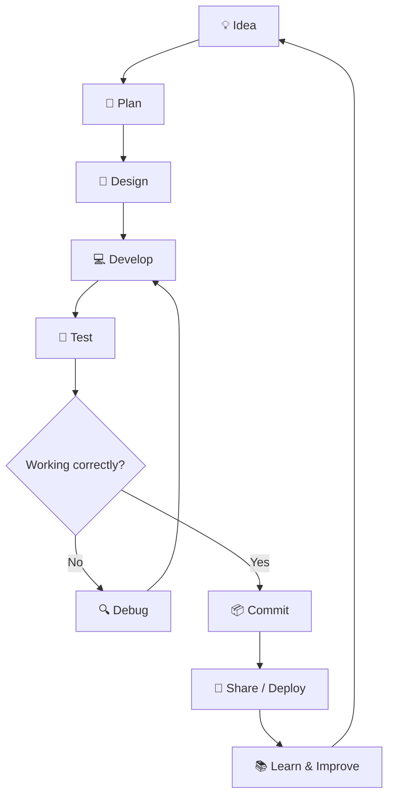

<!--
╔══════════════════════════════════════════════════════════════════════╗
║                   RAMESH BUDHA — GITHUB PROFILE                     ║
║        Animated • Interactive • Developer Portfolio README            ║
╚══════════════════════════════════════════════════════════════════════╝

HOW TO USE:
1. Open: https://github.com/rameshbudha253/rameshbudha253
2. Click README.md → Edit.
3. Replace the old content with this complete file.
4. Commit changes.

NOTE:
- Replace social links and email placeholders with your real details.
- GitHub README supports HTML and Markdown, but not JavaScript execution.
- Animations below use externally hosted SVG/GIF services.
-->

<!-- ═══════════════════════════════════════════════════════════════════ -->
<!--                         ANIMATED HERO                              -->
<!-- ═══════════════════════════════════════════════════════════════════ -->

<div align="center">

<a href="https://github.com/rameshbudha253">
  
</a>

<br/>


<br/><br/>

<a href="https://github.com/rameshbudha253">
  
</a>
<a href="https://github.com/rameshbudha253?tab=followers">
  
</a>
<a href="https://github.com/rameshbudha253?tab=repositories">
  
</a>

<br/><br/>

<a href="https://github.com/rameshbudha253">
  
</a>
<a href="https://github.com/rameshbudha253">
  
</a>
<a href="https://github.com/rameshbudha253">
  
</a>

</div>

---

<!-- ═══════════════════════════════════════════════════════════════════ -->
<!--                            ABOUT ME                                -->
<!-- ═══════════════════════════════════════════════════════════════════ -->

## 👨‍💻 About Me


Hi! I'm **Ramesh Budha**, an aspiring full-stack web developer and BICTE student from Nepal.

I enjoy learning how websites work, building practical projects, exploring new technologies, and turning ideas into useful digital experiences.

- 🎓 BICTE student at Ghodaghodi Multiple Campus.
- 💻 Interested in full-stack web development.
- 🌱 Currently strengthening my JavaScript and backend development skills.
- 🛠️ Learning to build applications with Node.js, Express.js, and MySQL.
- 🎨 Interested in modern UI/UX and responsive web design.
- 🚀 Building projects to improve my practical skills.
- 📚 Always learning and improving step by step.
- 🤝 Open to learning, collaboration, and meaningful projects.

<br clear="right"/>

> “Great developers are not born knowing everything. They keep learning, building, and improving.”

---

## 🧭 Quick Navigation

<div align="center">

| Section | Explore |
|:---:|:---:|
| 👨‍💻 About | [About Me](#-about-me) |
| 🛠️ Skills | [Tech Stack](#-tech-stack) |
| 📊 Statistics | [GitHub Stats](#-github-statistics) |
| 🚀 Projects | [Featured Projects](#-featured-projects) |
| 🎯 Learning | [Learning Roadmap](#-learning-roadmap) |
| 🤝 Connect | [Contact Me](#-connect-with-me) |

</div>

---

<!-- ═══════════════════════════════════════════════════════════════════ -->
<!--                         TECH STACK                                 -->
<!-- ═══════════════════════════════════════════════════════════════════ -->

## 🛠️ Tech Stack

### 💻 Languages

<div align="center">


</div>

### 🎨 Frontend Development

<div align="center">


</div>

- Semantic HTML
- Responsive CSS layouts
- JavaScript fundamentals
- DOM manipulation
- Interactive web interfaces
- Responsive design principles

### ⚙️ Backend Development

<div align="center">


</div>

- Node.js fundamentals
- Express.js basics
- REST API concepts
- Server-side application structure
- Routing and middleware concepts

### 🗄️ Database

<div align="center">


</div>

- MySQL
- Relational database concepts
- SQL queries
- CRUD operations
- Database design fundamentals

### 🧰 Tools & Platforms

<div align="center">


</div>

- Git and GitHub
- Visual Studio Code
- Windows
- Command-line fundamentals
- Debugging and troubleshooting

### 🎨 Design & Productivity

<div align="center">


</div>

- UI/UX fundamentals
- Visual design
- Canva
- Figma exploration

---

## 📈 My Technology Journey

<div align="center">

```text
Frontend Development
HTML ───── CSS ───── JavaScript
                         │
                         ▼
Backend Development
Node.js ───── Express.js
                         │
                         ▼
Database Development
MySQL ───── SQL ───── CRUD
                         │
                         ▼
Full-Stack Applications
Frontend + Backend + Database
```

</div>

---

<!-- ═══════════════════════════════════════════════════════════════════ -->
<!--                         GITHUB STATS                               -->
<!-- ═══════════════════════════════════════════════════════════════════ -->

## 📊 GitHub Statistics

<div align="center">

<a href="https://github.com/rameshbudha253">
  
</a>

<a href="https://github.com/rameshbudha253">
  
</a>

<br/><br/>

<a href="https://github.com/rameshbudha253">
  
</a>

</div>

---

## 🗓️ Contribution Activity

<div align="center">

<a href="https://github.com/rameshbudha253">
  
</a>

</div>

---

## 🏆 GitHub Trophies

<div align="center">

<a href="https://github.com/rameshbudha253">
  
</a>

</div>

---

<!-- ═══════════════════════════════════════════════════════════════════ -->
<!--                       FEATURED PROJECTS                            -->
<!-- ═══════════════════════════════════════════════════════════════════ -->

## 🚀 Featured Projects

Here are some projects from my GitHub repositories. Explore them to see my learning journey and practical work.

<div align="center">

<table>
<tr>
<td width="50%" valign="top">

### 🌌 Solar System

<a href="https://github.com/rameshbudha253/solar_system">
  
</a>

An educational project exploring the Solar System through a web-based experience.

**Focus areas:**
- Web interface development
- Visual presentation
- Interactive learning

</td>
<td width="50%" valign="top">

### 🛍️ E-Commerce

<a href="https://github.com/rameshbudha253/E-commers">
  
</a>

An e-commerce learning project focused on online shopping concepts and user interfaces.

**Focus areas:**
- Product presentation
- Shopping interface concepts
- Web development practice

</td>
</tr>

<tr>
<td width="50%" valign="top">

### 🏦 Nepal Banks SWIFT Code

<a href="https://github.com/rameshbudha253/Nepal-Banks-SWIFT-Code-web-site">
  
</a>

A website project related to Nepalese banks and SWIFT code information.

**Focus areas:**
- Information organization
- Search and presentation concepts
- Practical web development

</td>
<td width="50%" valign="top">

### 🎨 My Portfolio

<a href="https://github.com/rameshbudha253/My_portfolio">
  
</a>

A personal portfolio project to present my development journey and work.

**Focus areas:**
- Personal branding
- Responsive layout
- Project presentation

</td>
</tr>

<tr>
<td width="50%" valign="top">

### 🔊 Text to Speech

<a href="https://github.com/rameshbudha253/text_to_speech">
  
</a>

A project exploring text-to-speech functionality.

**Focus areas:**
- Text processing
- Speech synthesis concepts
- Interactive application behavior

</td>
<td width="50%" valign="top">

### 🤖 Voice Assistant

<a href="https://github.com/rameshbudha253/voice_assistant">
  
</a>

A Python-based learning project exploring voice assistant functionality.

**Focus areas:**
- Python practice
- Voice interaction concepts
- Automation exploration

</td>
</tr>
</table>

</div>

---

## 🎮 More Projects

<div align="center">

| Project | Description | Repository |
|---|---|---|
| 🕹️ Hangman Game | A word-guessing game project | [View](https://github.com/rameshbudha253/Hangman_game) |
| 🧮 Calculator | Calculator application project | [View](https://github.com/rameshbudha253/-calculator) |
| 💻 C++ Practice | Programming practice and exercises | [View](https://github.com/rameshbudha253/Day_1_cpp_program) |
| 💻 C++ Practice 2 | Additional C++ practice | [View](https://github.com/rameshbudha253/Day_2_cpp_progeam) |
| 🌱 Node.js Learning | Early Node.js learning project | [View](https://github.com/rameshbudha253/node_js_first_day) |

</div>

<br/>

<div align="center">

<a href="https://github.com/rameshbudha253?tab=repositories">
  
</a>

</div>

---

<!-- ═══════════════════════════════════════════════════════════════════ -->
<!--                        LEARNING ROADMAP                            -->
<!-- ═══════════════════════════════════════════════════════════════════ -->

## 🎯 Learning Roadmap

My goal is to become a confident full-stack developer by building projects and strengthening my fundamentals.

### 🟢 Current Learning Focus

- [x] HTML fundamentals
- [x] CSS fundamentals
- [x] JavaScript practice
- [ ] Improve JavaScript problem-solving
- [ ] Strengthen DOM manipulation
- [ ] Build more responsive interfaces
- [ ] Practice Git and GitHub workflows
- [ ] Improve debugging skills

### 🔵 Backend Development

- [ ] Strengthen Node.js fundamentals
- [ ] Learn Express.js in depth
- [ ] Build REST APIs
- [ ] Understand HTTP methods and status codes
- [ ] Practice authentication concepts
- [ ] Learn validation and error handling

### 🟣 Database Development

- [ ] Improve SQL query writing
- [ ] Practice relational database design
- [ ] Build projects using MySQL
- [ ] Understand joins and relationships
- [ ] Practice CRUD operations
- [ ] Learn database security fundamentals

### 🟡 Full-Stack Projects

- [ ] Build a complete task management app
- [ ] Build a student management system
- [ ] Build an e-commerce application
- [ ] Build a job portal
- [ ] Deploy a complete full-stack project
- [ ] Document projects with clear READMEs

---

## 🧠 What I'm Working to Improve

<div align="center">

| Area | Learning Goal |
|:---|:---|
| 🧩 Problem Solving | Break complex tasks into smaller steps |
| 💻 Coding | Write readable, maintainable code |
| 🏗️ Architecture | Understand how applications are structured |
| 🗄️ Databases | Design and query relational databases |
| 🎨 UI/UX | Build accessible, responsive interfaces |
| 🔍 Debugging | Find and fix problems systematically |
| 📖 Documentation | Explain projects clearly |
| 🤝 Collaboration | Learn through teamwork and feedback |

</div>

---

<!-- ═══════════════════════════════════════════════════════════════════ -->
<!--                          WORKFLOW                                  -->
<!-- ═══════════════════════════════════════════════════════════════════ -->

## 🔄 My Development Workflow

<div align="center">



</div>

---

## 🧰 Tools I Use

<div align="center">

| Tool | Purpose |
|:---:|---|
|  | Writing and editing code |
|  | Version control |
|  | Hosting and sharing repositories |
|  | Relational databases |
|  | Backend development practice |

</div>

---

<!-- ═══════════════════════════════════════════════════════════════════ -->
<!--                         GITHUB GOALS                               -->
<!-- ═══════════════════════════════════════════════════════════════════ -->

## 🌟 My Goals

- 🚀 Become a capable full-stack developer.
- 🧠 Build a strong foundation in programming.
- 🏗️ Create useful applications that solve real problems.
- 🌍 Contribute to open-source projects as I gain experience.
- 📚 Keep learning new tools and development practices.
- 🤝 Connect with developers and learn from their experience.
- 💼 Build a portfolio that demonstrates my skills and projects.

---

## 💬 Developer Mindset

<div align="center">


<br/><br/>

### ⚡ Learn → Build → Break → Fix → Improve

</div>

---

<!-- ═══════════════════════════════════════════════════════════════════ -->
<!--                         CONNECT                                    -->
<!-- ═══════════════════════════════════════════════════════════════════ -->

## 🤝 Connect With Me

I'm interested in connecting with fellow learners, developers, and people who enjoy building things with technology.

<div align="center">

<a href="https://github.com/rameshbudha253">
  
</a>

<!-- Replace the placeholder below with your real LinkedIn profile URL. -->
<a href="https://www.linkedin.com/">
  
</a>

<!-- Replace the placeholder below with your real Facebook profile URL. -->
<a href="https://www.facebook.com/">
  
</a>

<!-- Replace with your public contact email if you want to display it. -->
<a href="mailto:your-email@example.com">
  
</a>

<br/><br/>

<a href="https://github.com/rameshbudha253">
  
</a>

</div>

---

<!-- ═══════════════════════════════════════════════════════════════════ -->
<!--                         SUPPORT                                    -->
<!-- ═══════════════════════════════════════════════════════════════════ -->

## ⭐ Support My Work

If you find one of my projects interesting or useful:

- ⭐ Star the repository.
- 🍴 Fork it and experiment.
- 💬 Share feedback or suggestions.
- 🤝 Connect and collaborate.

Your feedback helps me learn and improve.

---

<!-- ═══════════════════════════════════════════════════════════════════ -->
<!--                         FOOTER                                     -->
<!-- ═══════════════════════════════════════════════════════════════════ -->

<div align="center">


### 💜 Thanks for visiting my GitHub profile!


<br/>

<sub>Designed with 💜 by Ramesh Budha • Built with Markdown, HTML, and GitHub README widgets</sub>

<br/><br/>

<a href="#-ramesh-budha--github-profile">
  
</a>

</div>
